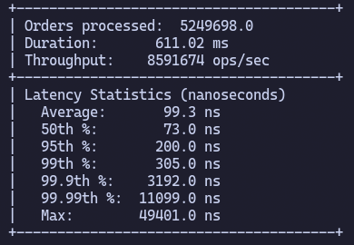

<h1 align="center">
  Agent-based orderbook simulation
</h1>

  A high-performance C++ simulation, designed to explore low-latency orderbook design, agent interactions, and multithreading.

  

<h2>
  Key Features
</h2>

  - Lock-free SPSC ring buffers for agent ↔ matching engine/orderbook communication
  - Multithreaded simulation architecture
  - L3 FIFO orderbook with O(1) best bid/ask lookup
  - Custom order pool to minimize allocations
  - Benchmarked at ~8.5M ops/sec with sub-100ns median latency

<h2>
  Introduction
</h2>
This project uses 3 different agents (Random, Market Makers and Momentum Traders) to simulate an orderbook.
A low-latency l3 orderbook has be designed for each agent to interact with placing buy and sell orders, as well as the ability to cancel active orders in accordance with their own strategies.

<h2>
  Build instructions
</h2>
<h3>
  Requirements
</h3>

- CMake 3.10+
- C++20 compatible compiler
- Google benchmark
  
<h3>
  Build
</h3>

    git clone https://github.com/seb-sns/agent-orderbook-simulation.git && cd agent-orderbook-simulation
    cmake -B build -DCMAKE_BUILD_TYPE=Release && cmake --build build -j
    
<h2>
  Running the program
</h2>
You can run the simulation directly from the build directory, if you wish to benchmark the program you can do so from the benchmark subdirectory.
<h4>
  Main Simulation
</h4>
    
    build/simulation
    
<h4>
  Benchmarks
</h4>
    
    build/benchmarks/benchmark_orderlatency
    build/benchmarks/benchmark_agentlatency
    build/benchmarks/benchmark_simulation
<h2>
  Simulation Design
</h2>

This simulation uses a set of 3 different agents (Random, Market Maker, Momentum Trader) to simulate an orderbook. Agent actions are sampled via a Poisson distribution to submit their orders to single-producor single-consumer (SPSC) lock-free ring buffer.
Agents will adjust their internal counters of cash/units when submitting such orders.
The matching engine pops orders from the aforementioned ring buffer and matches, adds, removes and/or cancels orders in the orderbook. The orderbook can use a trade dispatched to submit trades to agents via their own SPSC ring-buffer to allow agents to update their own internal state (i.e. units, cash).
The simulation uses three different threads:
  -  The outgoing agent actions where agents create and submit orders
  -  The matching engine/orderbook where orders are processed
  -  The incoming trades where agents recieve trade information

Since outgoing orders and incoming trade information run on seperate threads agents use mutexes (for keeping track of active orders) and lock-free methods (for keeping track of total cash/active units) 

<h2>
  Orderbook Design
</h2>

This is an L3 implimentation of an orderbook, where we store individual orders at each price level which are filled in FIFO (First in, first out) order.

  - Orders are allocated within an Orderpool (protected by a mutex), and the orderbook and agents will use pointers and indexes to allocate, deallocate and interact with orders.
  - The orderbook has an array of 2000 price levels (100 - 120, with 0.01 price ticks), for bids and asks, along with bitmaps to represent active and inactive price levels. It also maintains an index of the current best bid and ask for a fast look-up. 
  - Price levels themselves are organsied by an intrusively doubly linked list, so each order maintains the index to the next or previous order within the queue at that price level.
  - In order to cancel orders the orderbook uses a flat hash map to store active orders so we can quickly access orders by their respective order id.

<h3>
  Orderbook benchmarks
</h3>

When benchmarking 5'000'000 limit orders with an additional ~250'000 order cancellations the orderbook achieves:
  - **~8.5M operations per second**
  - **median latency of ~74ns**
  - **average latency of ~100ns**
  - **99.99% percentile orders at ~11'000ns**

  

<h2>
  Agent design
</h2>

A Poisson distribution is used to sample times at which an agent will act.
Each agent type has it's own way of deciding what orders place which are described below, but if they are unable to 'afford' an action (i.e. not enough cash left), they will instead skip their turn.

<h3>
  Random agents
</h3>

Whenever a random agent acts it has a 50/50 chance to either place a buy or sell order. 
They will place an order at a price normally distributed around the current midprice of the orderbook (or 110 if no midprice is available).
At every action, a random agent will look through it's orders and have a 5% chance to cancel it.

<h3>
  Market Maker agents
</h3>
Market Maker agents will look at the current mid price and place buy and sell orders within a given spread of that price.
If the current mid-price has grown outside some range from the previous mid-price the agent will cancel it's previously active orders.
<h3>
  Momentum Trader agents
</h3>
Momentum Traders use a ring buffer to keep track of both a short term and long term moving average.
When the difference between the two crosses some threshold, the agent will place market buy or sell orders depending on if the the trend is up or down.
Currently since the agent uses market orders (which will be cancelled if not filled). The Momentum Trader has no pressing need for cancel order logic.
<h3>
  Agent benchmarks
</h3>

A benchmark to measure performance of agents and their interactions with the orderbook is available and measures at increasing numbers of each type of agent, currently in single-digit millions of actions per second.
  
<h3>
  Benchmarking information
</h3>

All benchmarks were run on the following system:

  - Intel Core i7 4790K 4.4Ghz
  - 16GB DDR3 RAM
    
<h2>
  Further improvements
</h2>
- The benchmark for Agent latency is currently very noisy

- Agents always use fixed order sizes. With more complex agents we could have varying volumes that an agent might submit at any one time.

- Agents could improve on their logic by taking into account market volatility, Market Makers may want to adjust their spread during high volatility for example.

- Agents use an unoptimized data structure (std::unordered_map) to keep track of active orders. This becomes an expensive operation when scanning through active orders deciding on what to cancel. A more opitmized structure may want to split out active orders by bids and asks, further by organizing by price the agent would be able to quickly cancel orders in bulk by removing orders above or below a given price.
  
- All agents are stored within a single agent manager within a single container of Agents- there could be performance improvements from not having to containerize all agents (who have different strategies),
(a possible design difference would be to have each type of agent using a different thread to act rather than all being on the same thread), in addtion there could be a speed up through batch processing of agent actions (the disadvantage of batch processing actions is that each agent in a batch ends up with the same view of the orderbook then when acting in sequeunce)
