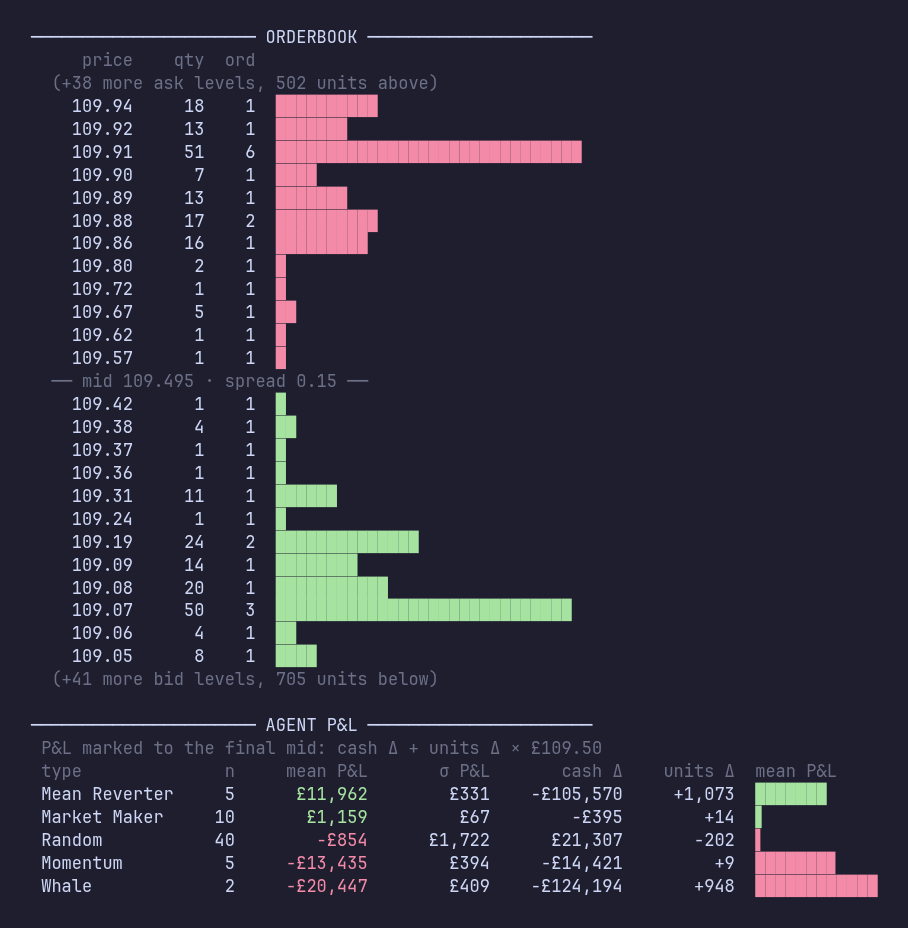
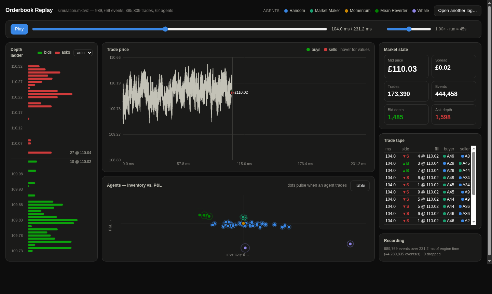
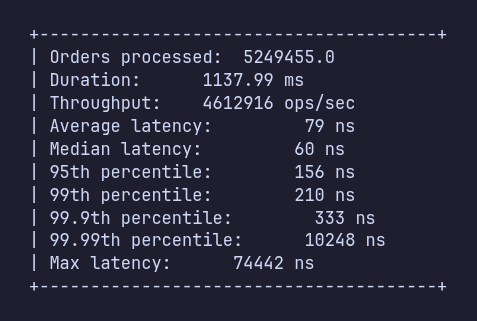

<h1 align="center">
  Agent-based orderbook simulation
</h1>

  A high-performance C++ simulation, designed to explore low-latency orderbook design, agent interactions, and multithreading.

  

<h2>
  Key Features
</h2>

  - Lock-free SPSC ring buffers for agent ↔ matching engine/orderbook communication
  - Multithreaded simulation architecture
  - L3 FIFO orderbook with O(1) best bid/ask lookup
  - Custom order pool to minimize allocations
  - Benchmarked at ~4.4M ops/sec with ~76ns median latency
  - Browser-based record + replay visualizer with zero overhead in the normal build

<h2>
  Introduction
</h2>
This project uses 5 different agent types (Random, Market Makers, Momentum Traders, Mean Reverters and Whales) to simulate an orderbook.
A low-latency l3 orderbook has be designed for each agent to interact with placing buy and sell orders, as well as the ability to cancel active orders in accordance with their own strategies.

<h2>
  Build instructions
</h2>
<h3>
  Requirements
</h3>

- CMake 3.10+
- C++20 compatible compiler
- Google benchmark
  
<h3>
  Build
</h3>

    git clone https://github.com/seb-sns/agent-orderbook-simulation.git && cd agent-orderbook-simulation
    cmake -B build -DCMAKE_BUILD_TYPE=Release && cmake --build build -j
    
<h2>
  Running the program
</h2>
You can run the simulation directly from the build directory, if you wish to benchmark the program you can do so from the benchmark subdirectory.
<h4>
  Main Simulation
</h4>
    
    build/simulation

The simulation asks a short series of questions (agent counts, action intervals, run length); every question shows a sensible default in brackets, so pressing Enter through all of them gives a good demo run.
    
<h4>
  Benchmarks
</h4>
    
    build/benchmarks/benchmark_orderlatency
    build/benchmarks/benchmark_agentlatency
    build/benchmarks/benchmark_simulation

<h2>
  Visualization (record + replay)
</h2>

The simulation can record every book mutation (adds, fills, cancels) to a binary event log which <code>viz/viewer.html</code> replays in the browser: an animated depth ladder (with adjustable price aggregation), trade-price chart, per-agent inventory/P&L swarm (colored by strategy, pulsing on trades), trade tape and live market stats, with play/pause, scrubbing and speed control.

  

    build/simulation_viz

This writes <code>simulation.mktviz</code> to the working directory — open <code>viz/viewer.html</code> in a browser and drop the file in.

<h4>
  Zero overhead in the normal build
</h4>

Recording is gated at compile time: the taps in the orderbook are macros that expand to nothing unless <code>ENABLE_VIZ</code> is defined, so the regular <code>simulation</code> target and all benchmarks compile to byte-identical machine code (verified via <code>objdump</code> diff in Release). Only the separate <code>simulation_viz</code> target pays the cost, and even there the hot path only does one lock-free SPSC ring-buffer push (~32-byte POD copy) per event — a dedicated writer thread drains the buffer to disk, and pushes never block (events are dropped and counted if the writer falls behind).

Note the log grows at 32 bytes/event, so prefer agent rates ≲1 action/time-unit and shorter runs for recordings — a few million events (~100&nbsp;MB) replay comfortably.
<h2>
  Simulation Design
</h2>

This simulation uses a set of 5 different agent types (Random, Market Maker, Momentum Trader, Mean Reverter, Whale) to simulate an orderbook. Agent actions are sampled via a Poisson distribution to submit their orders to single-producor single-consumer (SPSC) lock-free ring buffer.
Agents will adjust their internal counters of cash/units when submitting such orders.
The matching engine pops orders from the aforementioned ring buffer and matches, adds, removes and/or cancels orders in the orderbook. The orderbook can use a trade dispatched to submit trades to agents via their own SPSC ring-buffer to allow agents to update their own internal state (i.e. units, cash).
The simulation uses three different threads:
  -  The outgoing agent actions where agents create and submit orders
  -  The matching engine/orderbook where orders are processed
  -  The incoming trades where agents recieve trade information

Since outgoing orders and incoming trade information run on separate threads, agents keep cash/units in atomics and track their active orders without any locks: each agent's order records live only on the strategy thread, keyed by an agent-local sequence number stamped on every order. When an order rests on the book the engine echoes its assigned order id back over the trade path (an ACK), and the incoming thread forwards ACKs and retirements (fills/cancels) to the strategy thread over a lock-free SPSC ring. Cancels are built from these by-value records, so no pooled order memory is ever read across threads.

<h2>
  Orderbook Design
</h2>

This is an L3 implimentation of an orderbook, where we store individual orders at each price level which are filled in FIFO (First in, first out) order.

  - Orders are allocated within an Orderpool (protected by a mutex), and the orderbook and agents will use pointers and indexes to allocate, deallocate and interact with orders.
  - The orderbook has an array of 2000 price levels (100 - 120, with 0.01 price ticks), for bids and asks, along with bitmaps to represent active and inactive price levels. It also maintains an index of the current best bid and ask for a fast look-up. 
  - Price levels themselves are organsied by an intrusively doubly linked list, so each order maintains the index to the next or previous order within the queue at that price level.
  - In order to cancel orders the orderbook uses a flat hash map to store active orders so we can quickly access orders by their respective order id.

<h3>
  Orderbook benchmarks
</h3>

When benchmarking 5'000'000 orders (50/50 limit/market, quantities 1–20) with an additional ~250'000 cancellations of real resting orders, the orderbook achieves:
  - **~4.4M operations per second**
  - **median latency of ~76ns**
  - **average latency of ~110ns**
  - **99.99% percentile orders at ~10'000ns**

(Earlier reported figures of ~8.5M ops/sec came from a benchmark bug: trade dispatch was silently dropped, negative random quantities wrapped to ~4-billion-unit resting walls that made matching trivially cheap, and cancels targeted ids that could never match. The benchmark now streams orders, clamps quantities, cancels real resting orders and drains the trade path.)

  

<h2>
  Agent design
</h2>

A Poisson distribution is used to sample times at which an agent will act.
Each agent type has it's own way of deciding what orders place which are described below, but if they are unable to 'afford' an action (i.e. not enough cash left), they will instead skip their turn.

<h3>
  Random agents
</h3>

Whenever a random agent acts it has a 50/50 chance to either place a buy or sell order, with a uniformly random size (1–20 units). 
They will place an order at a price normally distributed around the current midprice of the orderbook (or 110 if no midprice is available).
At every action, a random agent will look through it's orders and have a 5% chance to cancel it.

<h3>
  Market Maker agents
</h3>
Market Maker agents cancel-and-replace: each action they withdraw all of their resting quotes and place a fresh buy/sell pair within a given spread of the current mid price.
Quote sizes are skewed by inventory — a maker that has accumulated units quotes a larger ask and smaller bid (and vice versa), leaning back towards a flat position.
<h3>
  Momentum Trader agents
</h3>
Momentum Traders use a ring buffer to keep track of both a short term and long term moving average.
When the relative divergence between the two crosses a threshold (0.5% by default), the agent places market buy or sell orders depending on if the trend is up or down, sized by conviction — the further past the threshold the signal is, the larger the order (10–50 units).
Currently since the agent uses market orders (which will be cancelled if not filled). The Momentum Trader has no pressing need for cancel order logic.
<h3>
  Mean Reverter agents
</h3>
Mean Reverters believe the asset has a fundamental fair value (110 by default). When the mid-price falls more than a band below fair value they lift the ask, and when it rises more than the band above they hit the bid — acting as a stabilising counterweight to the Momentum Traders. Order size scales with how deep the mispricing is relative to the band (10–50 units). Resting orders that no longer express the agent's current stance (the mid moved back inside the band, or the opinion flipped) are cancelled. Fair value is adaptive: each action it drifts toward the current mid by a small EWMA weight (0.01 per action by default, a ~200-time-unit half-life at the default interval), so a persistent repricing is eventually accepted as the new fair value rather than averaged into indefinitely — meaning a large enough shock can move the market permanently.
<h3>
  Whale agents
</h3>
Whales submit a single large market order on a random side each time they act, sized uniformly between half and double their configured base size (100 units by default, so 50–200). They are intended to act rarely (give them a long action interval) and create the price shocks that Momentum Traders chase and Mean Reverters fade.
<h3>
  Agent benchmarks
</h3>

A benchmark to measure performance of agents and their interactions with the orderbook is available and measures at increasing numbers of each type of agent: currently ~2–3.5M agent actions per second (~4–5M orders/s through the engine), roughly flat from 48 to 768 agents.
  
<h3>
  Benchmarking information
</h3>

All benchmarks were run on the following system:

  - Intel Core i7 4790K 4.4Ghz
  - 16GB DDR3 RAM

Benchmark threads are pinned to distinct physical cores (outgoing→cpu1, matching engine→cpu2, incoming→cpu3, see <code>include/ThreadPin.h</code>). For stable numbers run the suite through <code>sudo benchmarks/run_benchmarks.sh</code>, which sets the CPU governor to <code>performance</code> for the duration (add <code>--no-turbo</code> to also pin the clock below turbo) and restores your previous settings on exit.
    
<h2>
  Further improvements
</h2>
- The benchmark for Agent latency is currently very noisy

- Agents could improve on their logic by taking into account market volatility, Market Makers may want to adjust their spread during high volatility for example.

- Agents use an unoptimized data structure (std::unordered_map) to keep track of active orders. This becomes an expensive operation when scanning through active orders deciding on what to cancel. A more opitmized structure may want to split out active orders by bids and asks, further by organizing by price the agent would be able to quickly cancel orders in bulk by removing orders above or below a given price.
  
- All agents are stored within a single agent manager within a single container of Agents- there could be performance improvements from not having to containerize all agents (who have different strategies),
(a possible design difference would be to have each type of agent using a different thread to act rather than all being on the same thread), in addtion there could be a speed up through batch processing of agent actions (the disadvantage of batch processing actions is that each agent in a batch ends up with the same view of the orderbook then when acting in sequeunce)
